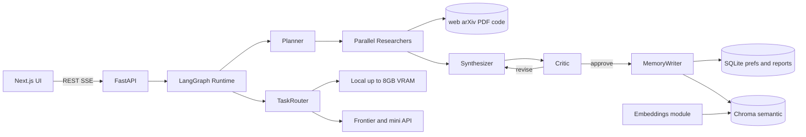

# AetherMind — Agentic Research & Report Generator

Autonomous research crew that takes a topic, plans sub-questions, runs tools in parallel (web, arXiv, PDF, code exec), synthesizes a cited structured report, self-evaluates against a rubric, iterates, and updates long-term memory of your preferences and past research.

## 1. Architecture at a glance




Key loop: `plan → (parallel tool calls) → draft → critic (rubric-scored) → revise up to N times → finalize → memory-write`.

### 1b. 8GB VRAM ceiling (local vs small API models)

Assume a single-GPU budget of **≤8GB VRAM** for anything that runs on-device (Ollama, `sentence-transformers`, small `transformers` classifiers). The router **does not** load larger local models; those tasks use **small hosted models** through LiteLLM to keep cost predictable and avoid OOM.


| Workload                                            | If it fits ≤8GB (typical)                                                  | If it would exceed 8GB                                                                                      |
| --------------------------------------------------- | -------------------------------------------------------------------------- | ----------------------------------------------------------------------------------------------------------- |
| Chat (planner / researcher / critic / pref extract) | Ollama `qwen2.5:3b` or `7b` **Q4** (not 14B+)                              | `openai/gpt-4o-mini`, `anthropic/claude-3-5-haiku-latest`, or similar                                       |
| Embeddings (high volume)                            | `BAAI/bge-small-en-v1.5`, `all-MiniLM-L6-v2`, or Ollama `nomic-embed-text` | Hosted `text-embedding-3-small` (or keep small local — preferred for cost)                                  |
| Reranker                                            | `BAAI/bge-reranker-base`                                                   | `bge-reranker-large` → API or skip rerank (embed-only recall)                                               |
| NLI / entailment (citation verifier)                | `cross-encoder/ms-marco-MiniLM-L-6-v2` or `roberta-base-mnli`              | `MoritzLaurer/DeBERTa-v3-large-`* → **not** local; use mini LLM entailment via API or smaller cross-encoder |
| Synthesis (user-visible quality)                    | Optional local 7B for drafts only                                          | **Default:** frontier API (Sonnet / GPT-4.1) for final report — not a VRAM issue but product quality        |


Implementation: `backend/app/llm/router.py` reads per-task env keys (`MODEL_PLANNER`, `MODEL_SYNTH`, `MODEL_CRITIC_INNER`, `MODEL_CRITIC_FINAL`, `MODEL_PREF_EXTRACT`, `MODEL_ENTAILMENT`, …) and flags `FORCE_API_FOR_HEAVY=true` / `LOCALVRAM_MAX_GB=8` so CI and no-GPU dev never attempt oversized local loads. Document approximate VRAM per choice in README.

### 1c. Cost-aware task tiers (what runs where)

These tiers stack with **1b**: anything in a tier that would exceed 8GB locally is **not** loaded on GPU; use small API or skip (e.g. embed-only recall without rerank).

- **Tier 0 — No LLM (always local, free):** PDF/chunking (`pymupdf`), HTML readability (`readability-lxml` / `trafilatura`), near-duplicate filtering (`datasketch` MinHash), token counting (`tiktoken`), domain allow/deny, version diff (frontend).
- **Tier 1 — Embeddings (highest call volume, default local):** `sentence-transformers` (e.g. `bge-small-en-v1.5`, `MiniLM`) or Ollama `nomic-embed-text`; optional hosted `text-embedding-3-small` via env. Implemented in `backend/app/embeddings/` and used for Chroma + `scratch_sources`.
- **Tier 2 — Auxiliary chat (short context, optional local Ollama):** preference extraction from feedback, report-summary compression before embedding, optional query reformulation, simple structured extraction — route to 3B–7B Q4 **or** mini API when VRAM tight or quality insufficient.
- **Tier 3 — Small specialized models (local if they fit ≤8GB):** cross-encoder rerank (`bge-reranker-base`), small NLI/entailment for citation checks; if a larger model is desired, use **mini API** entailment instead.
- **Tier 4 — Frontier API (low call count, user-visible quality):** planner (topic decomposition), synthesizer (final structured report), optional **final** critic pass before user sees output. Inner critic loop may use Tier 2/3 to save cost.

**Ollama ops:** configure `keep_alive` (e.g. `-1` on dev) to avoid cold-start latency on first request after idle.

## 2. Repo layout (monorepo)

```
AetherMind/
├── backend/
│   ├── pyproject.toml              # uv-managed Python 3.12
│   ├── app/
│   │   ├── main.py                 # FastAPI entry + CORS + SSE
│   │   ├── config.py               # pydantic-settings, .env
│   │   ├── db.py                   # SQLAlchemy + Alembic
│   │   ├── api/                    # /research, /reports, /feedback, /memory
│   │   ├── agent/
│   │   │   ├── graph.py            # LangGraph StateGraph assembly
│   │   │   ├── state.py            # TypedDict AgentState
│   │   │   ├── nodes/              # planner, researcher, synthesizer, critic, memory_writer
│   │   │   └── prompts/            # Jinja-templated prompts
│   │   ├── tools/                  # web_search (Tavily), arxiv, pdf_loader, code_exec (E2B), fetch
│   │   ├── memory/                 # sqlite_store, vector_store (Chroma), service.py
│   │   ├── llm/client.py           # LiteLLM wrapper + retry/backoff
│   │   ├── llm/router.py           # task → model; enforces ≤8GB local vs small API fallback
│   │   ├── embeddings/             # local embed + optional hosted fallback; never loads >8GB local
│   │   ├── eval/                   # rubrics, judge (LLM-as-judge), metrics
│   │   ├── guardrails/             # citation_verifier, source_policy
│   │   └── schemas/                # Pydantic: Report, Claim, Citation, Rubric, Feedback
│   └── tests/
├── frontend/                       # Next.js 15 App Router, Tailwind, shadcn/ui
│   ├── app/
│   │   ├── page.tsx                # New research job (topic + options)
│   │   ├── reports/[id]/page.tsx   # Live agent trace + versioned report + feedback box
│   │   └── memory/page.tsx         # Preferences + source allow/deny lists
│   ├── components/ReportView, AgentTrace, CitationPopover, VersionDiff, FeedbackForm
│   └── lib/api.ts                  # fetch + EventSource for SSE
├── docker-compose.yml              # api, frontend, chroma, (optional) langfuse
├── .env.example
└── README.md
```

## 3. Core data model (SQLite via SQLAlchemy)

- `users` (single-user okay for v1): id, name, created_at
- `preferences`: user_id, key, value (e.g., `preferred_sources`, `tone`, `depth`, `excluded_domains`)
- `research_jobs`: id, user_id, topic, status, rubric_id, created_at
- `reports`: id, job_id, version, markdown, json_blob, rubric_score, created_at
- `claims`: id, report_id, text, confidence
- `citations`: id, claim_id, source_type, url_or_doi, title, snippet, verified_bool
- `feedback`: id, report_id, user_comment, accepted_bool, created_at
- `agent_traces`: id, job_id, node, input_json, output_json, tokens, latency_ms

Chroma collections: `memory_preferences` (semantic prefs), `memory_reports` (past report summaries for cross-topic recall), `scratch_sources` (per-job deduped source embeddings so researchers don't re-read the same PDF chunks).

## 4. Agent graph (LangGraph)

State (simplified):

```python
class AgentState(TypedDict):
    topic: str
    preferences: dict
    plan: list[SubQuestion]
    findings: list[Finding]          # {sub_q, evidence[], tool_calls[]}
    draft: Report | None
    critique: Critique | None
    revisions: int
    approved: bool
    sources: list[Source]            # dedup registry for citation verification
```

Nodes:

- `planner` — decomposes topic into 3–7 sub-questions, selects tools per sub-q, loads user prefs from memory.
- `researcher` (fan-out) — one invocation per sub-question using `.map` / parallel `Send` API; each calls tools in parallel within itself (e.g., web + arXiv simultaneously).
- `synthesizer` — produces structured `Report` (Pydantic) with per-claim citation IDs referencing `sources`.
- `critic` — scores against rubric (accuracy, completeness, citation integrity, bias, structure). Emits revision directives. **Inner** passes may use local small / mini API (`MODEL_CRITIC_INNER`); optional **final** gate before UX approval may use a stronger or dedicated mini model (`MODEL_CRITIC_FINAL`) per router config.
- Conditional edge: if `critique.score < threshold` and `revisions < max_revisions`, route back to `synthesizer` (or `researcher` if evidence gaps). Else → `memory_writer`.
- `memory_writer` — persists prefs updates inferred from feedback, stores report summary embedding in Chroma.

LangGraph checkpointer: `SqliteSaver` — enables resume, time-travel, human-in-the-loop interrupts before finalization.

## 5. Tools

All tools conform to a `BaseTool` with JSON schema for LiteLLM function calling. Parallel execution via `asyncio.gather` inside each `researcher` node.

- `web_search` — Tavily API (good citations, snippet+url). Fallback: Brave Search.
- `arxiv_search` — `arxiv` pypi package; returns metadata + PDF url.
- `pdf_loader` — `pymupdf` for text + page-level chunking; stores chunks + embeddings in `scratch_sources` so downstream calls reuse.
- `code_exec` — **E2B sandbox** (remote) for safety; used for quick benchmarks/plots. Local fallback: `subprocess` with resource limits, opt-in only.
- `fetch_url` — `httpx` + readability-lxml for arbitrary web pages.

Every tool returns `ToolResult { content, source: Source }` so citations are traceable end-to-end.

## 6. Long-term memory (hybrid)

- **SQLite (structured):** explicit preferences, feedback history, saved reports, source allow/deny lists.
- **Chroma (semantic):** embeddings of past report summaries and free-text preferences ("I like concise reports focused on inference-time optimizations").
- On each new job, `planner` calls `memory.recall(topic)` which unions: (a) structured prefs for the user, (b) top-k semantic hits from `memory_preferences` + `memory_reports`. Injected into planner prompt.
- Feedback loop: when the user accepts/edits/rejects, `memory_writer` extracts preference deltas with an LLM extractor (e.g., "user wants more code examples") and writes both structured + embedded forms.

## 7. Guardrails (no fabricated sources)

- **Source registry:** every tool result is registered with a UUID; synthesizer must cite only registered IDs. Pydantic validator rejects unknown IDs.
- **Citation verifier (post-synthesis):** for each claim, confirm the cited source's snippet actually supports the claim via a small local cross-encoder/NLI **if** it fits the VRAM budget; otherwise a **small API** entailment pass (same router as `MODEL_ENTAILMENT`) plus string overlap heuristic. Unverified claims are flagged and sent back to critic.
- **Source policy:** per-user allow/deny domains; violations stripped before synthesis.
- **Refusal path:** if a sub-question has no evidence meeting min-confidence, the report explicitly states "insufficient evidence" instead of inventing.

## 8. Evaluation

Rubric (0–5 each), pluggable:

- Accuracy (evidence-grounded)
- Completeness (all sub-questions answered)
- Citation integrity (% claims verified)
- Bias/neutrality
- Structure/clarity

Two layers:

- **Online critic** inside the graph (same rubric, triggers revision; model(s) from router — inner vs final as in §4).
- **Offline eval harness** (`backend/app/eval/harness.py`) running LLM-as-judge plus Ragas-style adapted metrics (faithfulness, answer relevance, context precision) on a small fixtures set. Report scores surfaced in the UI and logged to Langfuse if enabled.

## 9. API surface (FastAPI)

- `POST /research` — body: `{ topic, options }` → returns `job_id`.
- `GET /research/{job_id}/stream` — SSE: planner plan, each tool call, drafts, critiques, final.
- `GET /reports/{id}` and `GET /reports/{id}/versions`.
- `POST /feedback` — body: `{ report_id, comment, accept }` → triggers memory update + optional re-run.
- `GET/POST /memory/preferences` — view/edit structured prefs.

## 10. Frontend (Next.js)

- New research page: topic input + advanced options (depth, tool toggles, preferred sources).
- Report page: live agent trace panel (streamed), rendered Markdown report with hover-to-see citation snippets, version dropdown with diff view, feedback box that posts to `/feedback`.
- Memory page: table of preferences + allow/deny list editor + list of past reports with semantic search box.

Styling: Tailwind + shadcn/ui. Use `react-markdown` + `remark-gfm` for the report, `diff-match-patch` for versions.

## 11. Observability & ops

- Langfuse (self-hosted via docker-compose) for traces of every LangGraph node + tool call.
- Structured logs with `structlog`.
- `.env.example` — API keys (`OPENAI_API_KEY`, `ANTHROPIC_API_KEY`, `TAVILY_API_KEY`, `E2B_API_KEY`, `LANGFUSE_`*); `LOCALVRAM_MAX_GB=8`; `FORCE_API_FOR_HEAVY=true` (optional); `OLLAMA_BASE_URL`, `OLLAMA_KEEP_ALIVE`; embeddings `EMBEDDINGS_PROVIDER`, `EMBEDDINGS_MODEL`; per-task models e.g. `MODEL_PLANNER`, `MODEL_SYNTH`, `MODEL_CRITIC_INNER`, `MODEL_CRITIC_FINAL`, `MODEL_PREF_EXTRACT`, `MODEL_ENTAILMENT`, `MODEL_EVAL_JUDGE` (default cheap mini for harness).

Example fragment (values illustrative):

```bash
LOCALVRAM_MAX_GB=8
FORCE_API_FOR_HEAVY=false
MODEL_PLANNER=openai/gpt-5.4
MODEL_SYNTH=openai/gpt-5.4
MODEL_CRITIC_INNER=ollama/qwen3.5:7b
MODEL_CRITIC_FINAL=openai/gpt-5.4-mini
MODEL_PREF_EXTRACT=ollama/qwen3.5:7b
MODEL_ENTAILMENT=openai/gpt-5.4-mini
MODEL_EVAL_JUDGE=openai/gpt-5.4-mini
EMBEDDINGS_PROVIDER=sentence-transformers
EMBEDDINGS_MODEL=BAAI/bge-small-en-v1.5
```

## 12. Phased build order

Suggested sequence (aligns with todos):

1. **bootstrap** — monorepo, docker-compose (API, frontend, Chroma, optional Langfuse), `.gitignore`.
2. **llm_gateway** + **vram_router** + **embeddings_module** — LiteLLM client, task router (8GB policy + `FORCE_API_FOR_HEAVY`), embedding client wired to Chroma-ready interfaces.
3. **schemas** + **db_layer** — Pydantic + SQLAlchemy/Alembic.
4. **tool_stubs** — tools + optional MinHash dedup before embed.
5. **langgraph_core** + **parallel_research** + **critic_loop** — graph wired to router for each node role.
6. **guardrails** + **memory_service** — citation verifier (local small NLI vs API mini), hybrid memory with router for pref extract/summaries.
7. **fastapi_endpoints** — REST + SSE.
8. **frontend_*** — new research, report view, memory pages.
9. **eval_harness** — offline judge (cheap default model).
10. **observability** + **tests**; **stretch** as time allows.

## 13. Stretch / optional

- Multimodal figure extraction from PDFs (pymupdf + vision model describes figure → embedded in report).
- Scheduled "research digests" (APScheduler nightly job on saved topics).
- Export to PDF/Notion.

